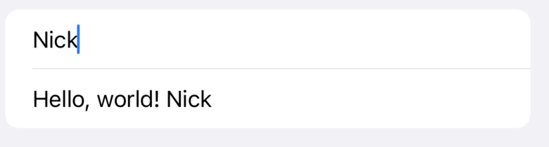

# Form, NavigationView, @State

Form


```swift 
From {
    Section {
        Text("First Section")
        Text("First Section")
    }

    Section {
        Text("Second Section")
        Text("Second Section")
        Text("Second Section")
    }
}
```

NavigationView


```swift
NavigationView {
            Form {
                Section {
                    Text("Hello, world!")
                }
            }
            .navigationTitle("SwiftUI")
            .navigationBarTitleDisplayMode(.large)
        }
```


@State


to store data in Swift-UI need to use @State

```swift
    @State private var tapCount = 0
    
    var body: some View {
        
        Button("Tap Count: \(tapCount)") {
            self.tapCount += 1
        }
    }

```



if you want to read write data and sent it back to UI element need to use: "$" sign example: 
TextField 

```swift
    @State private var name = ""

    var body: some View {
        Form {
            TextField("Enter your name", text: $name)
            Text("Hello, \(name)")
        }
    }
```
