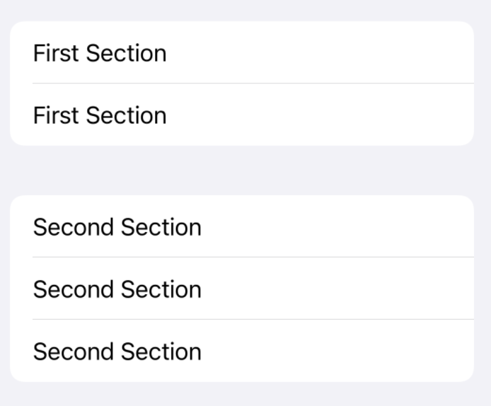

# Form, NavigationView, @State

Form



```swift 
From {
    Section {
        Text("First Section")
        Text("First Section")
    }

    Section {
        Text("Second Section")
        Text("Second Section")
        Text("Second Section")
    }
}
```